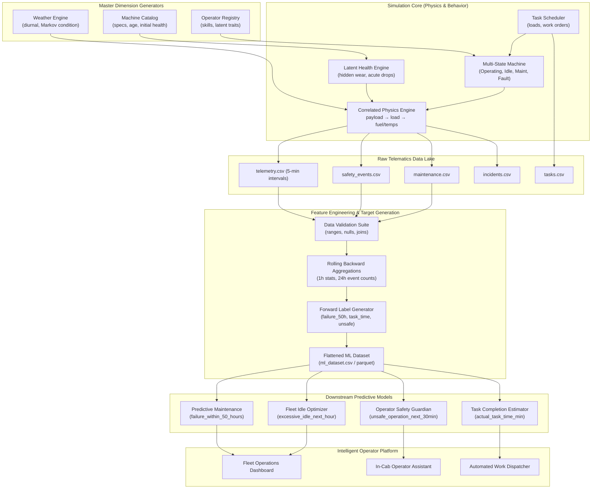

# Industrial Telemetry Data Pipeline Architecture

This document describes the end-to-end synthetic data generation architecture, feature transformation flow, leakage-prevention mechanics, and predictive analytics serving layer.

---

## 1. System Architecture

The pipeline models a modern industrial IoT telematics and analytics architecture:

---

## 2. Pipeline Execution Stages

### Stage 1: Fleet & Environmental Setup
1. **Machine Catalog Generation**: Defines physical capacities, rated payload, engine class, and age.
2. **Operator Latent Profiling**: Assigns observable traits (skill, certifications) and latent behavioral parameters (idle tendency, risk multiplier, cycle speed).
3. **Weather Engine**: Simulates hourly weather per jobsite using a Markov transition matrix for condition states and sinusoidal diurnal models for temperature.

### Stage 2: Time-Stepped Multi-State Telemetry Simulation
The simulation steps through time in 5-minute increments per machine:
- **State Selection**: Markov state transitions (OPERATING, LOADING, TRAVELLING, IDLE, FAULT, MAINTENANCE) adjusted for time of day, operator idle propensity, and machine health.
- **Physical Correlation Chain**:
  $$\text{Payload} \longrightarrow \text{Engine Load} \longrightarrow \text{Fuel Rate} \longrightarrow \text{Thermal Loads (Coolant \& Oil)}$$
  $$\text{Machine Age} + \text{Operating Wear} \longrightarrow \text{Hydraulic Temp Offset} + \text{Pressure Jitter} \longrightarrow \text{Fault Probability}$$
- **Event Emission**: Concurrently writes safety violations, diagnostic trouble codes, and maintenance records.

### Stage 3: Feature Engineering (No Lookahead)
- Computes physical ratios (`fuel_efficiency_tonnes_per_litre`, `hydraulic_stress_index`, `temperature_deviation_from_baseline`).
- Applies backward-looking rolling windows grouped by `machine_id`:
  - 1-hour window (12 steps): rolling mean of engine load, coolant temp, oil pressure, hydraulic temp, standard deviation of hydraulic temp, hourly payload, hourly fuel.
  - 24-hour window (288 steps): rolling count of diagnostic trouble codes and safety events.

### Stage 4: Predictive Label Generation
- Generates forward-looking ground-truth targets strictly for training supervision:
  - `failure_within_50_hours`: Looks ahead up to 50 cumulative operating hours.
  - `unsafe_operation_next_30min`: Forward window of 6 steps ($t+1$ to $t+6$).
  - `excessive_idle_next_hour`: Forward window of 12 steps ($t+1$ to $t+12$).

### Stage 5: Validation Audit & Parquet Export
- Automatically verifies schema completeness, foreign key referential integrity, absence of nulls, zero duplicate timestamp records, and physical boundary constraints.
- Writes structured `validation_report.json` and optimized columnar `.parquet` files.

---

## 3. Downstream Consumption & Integration

The generated datasets directly power the hackathon solution stack:

1. **Predictive Maintenance Dashboard**:
   - Consumes `ml_dataset.csv` predictions to flag machines requiring servicing before failure occurs.
   - Example: Spotlights `EXC007` exhibiting elevated hydraulic temperatures and rising stress index.
2. **In-Cab Operator Assistant**:
   - Monitors live sensor stream for real-time safety advisories when `unsafe_operation_next_30min` probability exceeds thresholds.
   - Provides gentle coaching to high-idle operators like `EXC004`.
3. **Task Completion & Dispatcher**:
   - Ingests task duration estimates to plan truck dispatch cycles and avoid loader queue bottlenecks.
