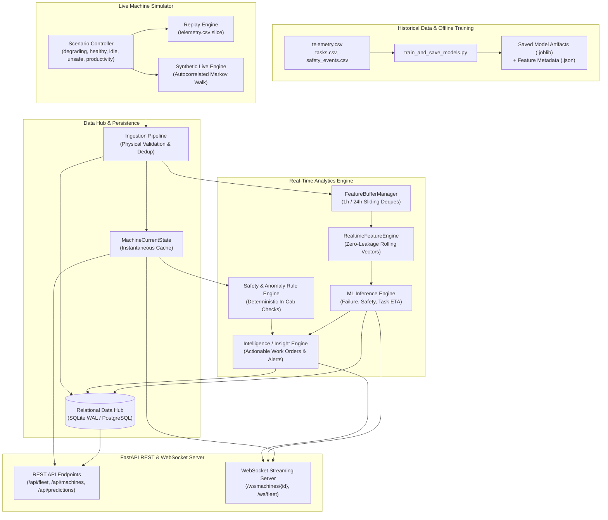
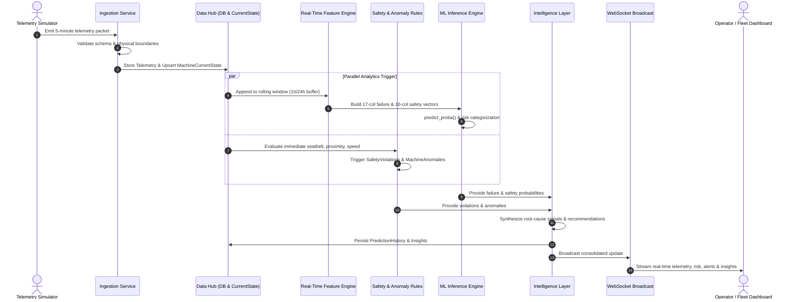
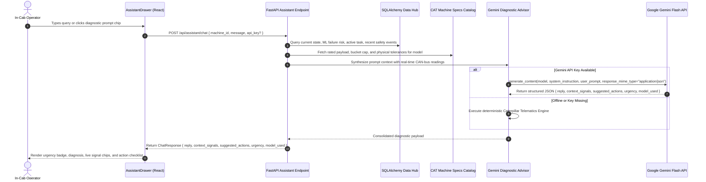

# Real-Time Telematics & Intelligence Architecture

## 1. System Architecture Overview

The `cat_machine_data` real-time architecture transitions the static, audited synthetic dataset into a live, interactive industrial IoT environment.



---

## 2. End-to-End Information Flow



---

## 3. Component Deep Dive

### 3.1 Model Persistence & Schema Enforcement
Model artifacts and feature metadata are persisted in `models/`:
- `failure_model.joblib` + `failure_model_metadata.json`: Random Forest Classifier trained on 17 physical and backward-looking thermodynamic features.
- `safety_model.joblib` + `safety_model_metadata.json`: Random Forest Classifier trained on 10 contextual features.
- `task_time_model.joblib` + `task_time_model_metadata.json`: Random Forest Regressor trained on 11 pre-dispatch task variables.

Each `.json` metadata file strictly defines `feature_order`. The `ModelLoader` validates feature names and column ordering before inference, eliminating training-serving skew.

### 3.2 Real-Time Feature Engine & Zero-Leakage Guarantee
The `RealtimeFeatureEngine` uses in-memory circular buffers (`FeatureBufferManager`) preloaded from the database on startup:
1. **Instantaneous Physical Features**:
   - $\text{hydraulic\_stress\_index} = \left(\frac{\text{hydraulic\_pressure\_bar}}{350}\right) \times \left(\frac{\text{hydraulic\_temp\_c}}{100}\right)$
   - $\text{temperature\_deviation\_from\_baseline} = \text{coolant\_temp\_c} - (\text{ambient\_temp} + 65.0)$
2. **1-Hour Rolling Aggregations** (12 steps):
   - Rolling means: `engine_load_avg_1h`, `coolant_temp_avg_1h`, `oil_pressure_avg_1h`, `hydraulic_temp_avg_1h`
   - Rolling standard deviation: `hydraulic_temp_std_1h` (volatility proxy)
   - Operational duty cycles: `average_cycle_time`, `idle_percentage`
3. **24-Hour Rolling Event Counts** (288 steps):
   - `safety_events_24h`

**Strict Leakage Protection**: Future labels (`failure_within_50_hours`, `unsafe_operation_next_30min`, `actual_task_time_min`), latent `health_score`, and post-event fault codes are strictly excluded from all feature vectors.

### 3.3 Rule Engine
- **Safety Rules (`SafetyRuleEngine`)**: Immediate evaluation of in-cab conditions:
  - `RULE-SAF-001` (Critical): Operating or moving with seatbelt unbuckled.
  - `RULE-SAF-002` (High): Proximity alarm active while vehicle is in motion.
  - `RULE-SAF-003` (Warning): Contextual site overspeed violation.
  - `RULE-SAF-004` (Critical): Multi-hazard compound risk (speed + payload + low visibility + proximity).
- **Machine Anomaly Rules (`MachineRuleEngine`)**: Thermodynamic threshold and baseline drift evaluation:
  - `DEV-HYD-001` (High): Hydraulic fluid temperature $> 85.0^\circ\text{C}$.
  - `DEV-OIL-002` (High): Engine oil pressure $< 2.3\text{ bar}$ under load.
  - `DEV-HYD-003` (Medium): Elevated composite hydraulic stress index $> 0.65$.
  - `DEV-HYD-004` (Medium): Hydraulic thermal instability (std $> 3.0^\circ\text{C}$).
  - `DEV-OP-006` (Info): Chronic operational idling in recent 1-hour window ($> 50\%$).

### 3.4 Intelligence Layer (`InsightEngine`)
Converts raw telemetry deviations and ML scores into structured recommendations:
- **Predictive Maintenance**: Failure risk attribution to specific physical signals (e.g. "Hydraulic temperature trend elevated, lubrication gallery pressure drop").
- **Operational Efficiency**: Calculates wasted diesel liters and financial cost from excessive idling.
- **Safety Guardianship**: Combines immediate rule violations with 30-minute predictive risk alerts.
- **Lifecycle Management**: Insights transition across `ACTIVE` $\rightarrow$ `ACKNOWLEDGED` $\rightarrow$ `RESOLVED`.

---

## 4. REST API & WebSocket Protocol

### Key REST Endpoints
| Method | Path | Description |
| :--- | :--- | :--- |
| `GET` | `/api/health` | Service health status |
| `GET` | `/api/fleet/summary` | Fleet operational counts, utilization, idle stats |
| `GET` | `/api/machines` | Catalog of all machines |
| `GET` | `/api/machines/{id}` | Machine metadata and specifications |
| `GET` | `/api/machines/{id}/dashboard` | **Consolidated payload** for instantaneous frontend loading |
| `GET` | `/api/machines/{id}/health` | Presentation-level health status (zero leakage) |
| `GET` | `/api/machines/{id}/telemetry` | Recent historical observations for charting |
| `POST` | `/api/telemetry/ingest` | Telemetry packet ingestion endpoint |
| `POST` | `/api/predictions/failure/{id}` | On-demand failure prediction |
| `POST` | `/api/predictions/safety/{id}` | On-demand 30-minute safety risk prediction |
| `POST` | `/api/predictions/task-time` | Task duration regression and remaining ETA |
| `GET` | `/api/predictions/{id}/history` | Historical prediction time-series |
| `GET` | `/api/safety/alerts` | Active safety alerts across fleet |
| `GET` | `/api/insights/{id}` | Active insights and recommendations |
| `POST` | `/api/insights/{id}/acknowledge`| Acknowledge an active insight |

### WebSocket Protocol (`/ws/machines/{machine_id}`)
When connected, clients receive real-time JSON packets whenever a new telemetry observation is processed:
```json
{
  "timestamp": "2026-01-16 15:15:00",
  "machine_id": "EXC007",
  "telemetry": {
    "rpm": 1768.0,
    "load_pct": 68.0,
    "coolant_temp": 86.5,
    "oil_pressure": 3.99,
    "hydraulic_temp": 75.0,
    "hydraulic_pressure": 290.0,
    "status": "OPERATING",
    "fuel_rate": 18.2
  },
  "safety": {
    "seatbelt": true,
    "proximity": false,
    "overspeed": true,
    "violations_count": 1,
    "violations": [
      {
        "severity": "WARNING",
        "title": "Contextual Overspeed",
        "message": "In-cab telematics overspeed alert triggered at 4.8 km/h."
      }
    ]
  },
  "predictions": {
    "failure_probability": 0.706,
    "risk_level": "HIGH",
    "signals": [
      "Hydraulic temperature trend elevated",
      "Sustained hydraulic system stress"
    ],
    "unsafe_probability_30m": 0.12
  },
  "insights": [
    {
      "insight_id": "INS-PDM-EXC007-FAIL",
      "type": "PREDICTIVE_MAINTENANCE",
      "severity": "HIGH",
      "title": "Machine Failure Risk Elevated (HIGH)",
      "message": "Model predicts 70.6% probability of failure within 50 operating hours.",
      "recommended_action": "Schedule immediate priority shop inspection and oil analysis.",
      "status": "ACTIVE"
    }
  ]
}
```

---

## 5. Demonstration Scenarios

| Scenario | Machine ID | Machine Model | Operational Phenomenon | Expected System Response |
| :--- | :--- | :--- | :--- | :--- |
| `degrading` | `EXC007` | Cat 336 | Hydraulic pump wear & seal leakage | Failure probability climbs $59\% \rightarrow 71\%$; triggers High Risk insight and maintenance work order |
| `healthy` | `EXC001` | Cat 320 GC | Baseline excavation duty | Stable thermal balance; failure probability $< 5\%$; zero safety infractions |
| `excessive_idle`| `EXC004` | Cat 323 | Chronic staging and waiting queues | Idling $> 75\%$; calculates wasted diesel (liters and USD); triggers auto-shutdown recommendation |
| `unsafe` | `EXC008` | Cat 320 GC | Hazardous operator behavior | Immediate seatbelt and proximity rule violations; elevated 30-min predictive risk |
| `productivity` | `LOD001` | Cat 950 GC | Heavy aggregate truck loading | High utilization ($> 85\%$), rapid cycle pace, and optimal fuel burn |

---

## 6. Google Gemini AI Diagnostic Advisor Architecture

The in-cab AI companion (`POST /api/assistant/chat`) integrates Google's **Gemini API** (`gemini-flash-lite-latest` / `gemini-2.5-flash`) via the `google-genai` Python SDK to perform real-time generative diagnostic reasoning.



### Context Synthesis Schema Injected into Gemini:
1. **Machine Model Engineering Limits (`CAT_MACHINE_SPECS`)**:
   - Model name, equipment type, operating weight, rated vs max payload.
   - Design operational ceilings: Hydraulic temp (`45.0 - 80.0 °C`), hydraulic pressure (`150 - 320 bar`), oil gallery pressure (`2.8 - 5.0 bar`, warning `< 2.5 bar`).
2. **Instantaneous CAN-bus Telematics**:
   - Exact physical readings (`hydraulic_temp_c`, `oil_pressure_bar`, `engine_rpm`, `engine_load_pct`, `coolant_temp_c`, `speed_kmh`, `payload_tonnes`).
3. **ML Failure & Safety Predictions**:
   - 50-hour failure probability %, risk level (`CRITICAL`, `HIGH`, `MEDIUM`, `LOW`), top driving telemetry features.
4. **Active Work Order Dispatch**:
   - Task type, target tonnes, actual tonnes moved, cycle count, cycle time variance, remaining estimated minutes.
5. **Active Intelligence Insights**:
   - High-priority operational recommendations from the rule engine.

